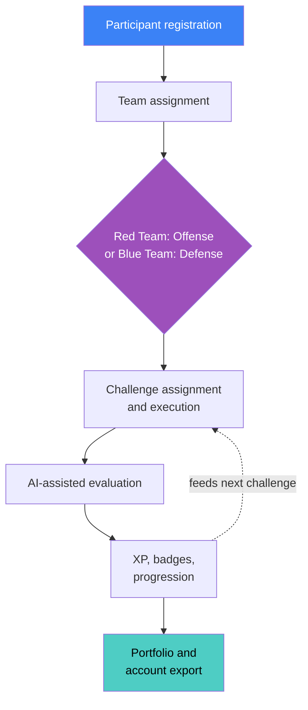
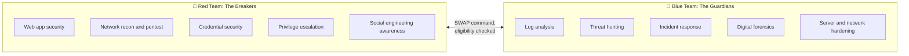
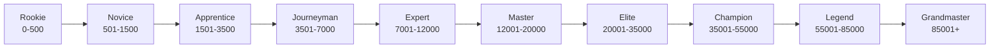
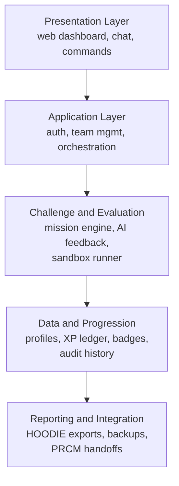
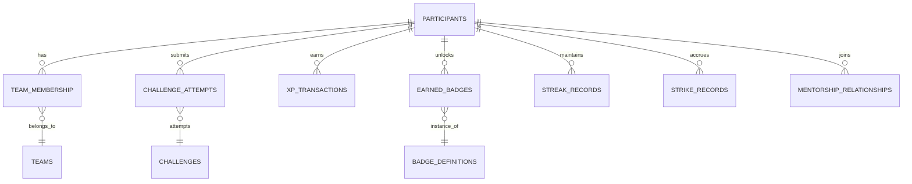
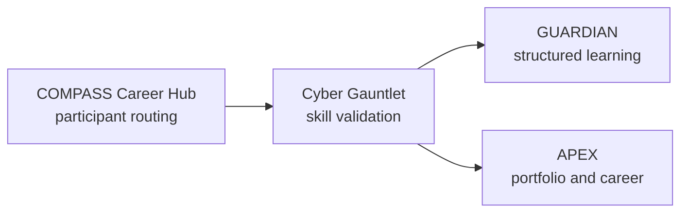

# ⚔️ Cyber Gauntlet

### The Hoodie Challenge Arena

<div align="center">


**Be a zero or a Hero. Your choice.**

AI-powered cybersecurity competition platform: Red Team vs Blue Team challenges, skill validation, and gamification. Part of the PRCM™ Labor / COMPASS Career Hub ecosystem.

</div>

---

## Overview

Cyber Gauntlet is an AI-powered cybersecurity competition platform that turns traditional cybersecurity education into an interactive, competitive, and measurable skill-development experience.

The platform operates as a virtual arena called **Red vs Blue: The Hoodie Challenge Arena**, where participants complete realistic cybersecurity challenges, demonstrate technical competency, earn experience points (XP), unlock achievement badges, and progress through a structured ranking system.

Rather than measuring course completion or theoretical knowledge, Cyber Gauntlet validates practical skills through hands-on challenges: offensive security exercises, defensive investigations, technical problem-solving, and collaborative team missions. An evaluation engine assesses submissions, gives contextual feedback, tracks progress, and rewards demonstrated competency, building a portfolio of validated achievements.

**Core objectives:**

- Validate cybersecurity skills through practical challenges.
- Create competitive learning through Red Team and Blue Team exercises.
- Track progression using XP, badges, ranks, and performance metrics.
- Encourage consistent participation through daily streaks and milestones.
- Bring Lean Manufacturing principles into technical skill development.
- Facilitate mentorship between experienced practitioners and learners.
- Generate documented, exportable achievement records.
- Connect skill validation to the broader PRCM™ Labor ecosystem.

## How the Platform Works



Each stage feeds the next: completing a challenge raises XP, updates skill records, contributes to team score, and can unlock a badge or a harder difficulty tier.

## Participant Registration and Identity

Onboarding introduces the competition, rules, and rewards, then collects a name, a competition username, a profile image, and a classification, before assigning a team and creating the initial profile.

| Classification | Description |
|---|---|
| Student | Active learner with access to competition challenges and student rewards |
| Alumni | Graduated participant who can compete, access advanced challenges, and mentor |
| Prospect | Potential student exploring the competition through limited demo access |

Classification is independent of team: an alumnus may be on the Blue Team while a student is on the Red Team.

Example starting profile (illustrative, not a real record):

```json
{
  "participant_id": "unique_identifier",
  "real_name": "Participant Name",
  "username": "CyberHero",
  "team": "Blue Team",
  "tier": "Student",
  "level": 1,
  "total_xp": 0,
  "badges": [],
  "completed_challenges": [],
  "current_streak": 0,
  "strike_count": 0
}
```

A standalone application should use unique participant identifiers and secure authentication. Guaranteeing username uniqueness across all participants needs a shared identity database; a conversation-only GPT cannot enforce that reliably.

## Red Team vs Blue Team



*Red Team example mission*: identify a SQL injection vulnerability in an intentionally vulnerable login form, demonstrate it within an authorized lab, explain its security impact, and document remediation.

*Blue Team example mission*: investigate simulated web server logs, identify suspicious activity, classify attack patterns, and recommend containment and monitoring improvements.

**Team switching**: request a switch with `SWAP`. Eligibility requires Level 3 or higher, at least 10 completed challenges on the current team, no strikes in the preceding 30 days, and at least 30 days since the last switch. Approved changes preserve overall XP and badges while resetting team-specific quest progress.

## Challenge Engine

Each challenge has an identifier: `[TEAM]_[CATEGORY]_[DIFFICULTY]_[NUMBER]`, for example `RED_WEB_BASIC_001`, `BLUE_LOG_INT_001`, `RED_NET_ADV_001`, `LEAN_PROCESS_BONUS_003`.

| Difficulty | XP | Levels | Description |
|---|---|---|---|
| Basic | 100 | 1 to 2 | Foundational concepts, single-step exercises |
| Intermediate | 250 | 3 to 4 | Multi-step problems requiring practical application |
| Advanced | 500 | 5 to 6 | Complex scenarios combining multiple skills |
| Expert | 1,000 | 7 to 10 | Professional-level, multi-stage simulations |

Example challenge record:

```json
{
  "challenge_id": "BLUE_LOG_BASIC_001",
  "title": "Log Analysis Fundamentals",
  "team": "Blue Team",
  "category": "Log Analysis",
  "difficulty": "Basic",
  "base_xp": 100,
  "skills": ["Log Analysis", "Threat Detection", "Incident Response"],
  "objective": "Identify suspicious web server activity",
  "deliverables": ["Suspicious log entries", "Attack classification", "Recommended response actions"]
}
```

**Evaluation outcomes:**

| Submission result | System response |
|---|---|
| Correct and relevant | Full XP plus applicable bonuses |
| Partially correct | Partial XP and constructive guidance |
| Incorrect but relevant | No completion XP, educational feedback |
| Off-topic or irrelevant | No XP, a strike under competition rules |

Participants can self-flag uncertain submissions to request guidance without an automatic strike for irrelevance. A standalone implementation should favor objective checks and executable tests, with clear rubrics and human review for disputed results. All offensive exercises must run in authorized, isolated training environments.

## XP, Levels, Badges, and Gamification

| Achievement | XP |
|---|---|
| Lean bonus mission | +50 |
| Speed bonus | +25 |
| Perfect execution | +100 |
| Creative solution | +75 |
| Team quest participation | +150 |
| Mentoring session | +200 |
| Helping a teammate | +50 |

Temporary boosts: an individual boost doubles XP for the next challenge (three uses per month); a team boost gives a 1.5x multiplier for 24 hours after a successful team vote.



**Badge categories:** Offensive Security (Lock Picker, Penetration Pro, Web Warrior, Credential Cracker, Privilege Escalator), Defensive Security (Blue Shield, Threat Hunter, Incident Responder, Firewall Master, Forensics Expert), Lean Performance (Efficiency Champion, Value Stream Mapper, Just-In-Time Learner, Kaizen Master, Quality First), and Competition Achievements (First Blood, Hot Streak, Century, Champion, Mentor, Veteran, Gauntlet Master). Skill badges progress through Bronze, Silver, Gold, and Platinum tiers.

Daily streaks reward consistency with increasing XP bonuses and milestone badges, plus one proactively-activated streak freeze per 30-day period.

## Lean Manufacturing Integration

| Lean principle | Application |
|---|---|
| Value Stream Mapping | Map challenges to competencies and cut unnecessary practice |
| Just-In-Time Learning | Present challenges matched to current skill level |
| Kaizen | Encourage continuous improvement through feedback and refinement |
| Pull System | Let participants choose challenges when ready |
| Quality at Source | Give immediate feedback and validate understanding before advancing |

## Team Quests, Collaboration, and Mentorship

Team quests are multi-stage exercises requiring at least three participants, each with distinct responsibilities. All stages must complete before the shared reward is granted.

| Quest tier | Stages | Shared XP pool |
|---|---|---|
| Bronze | 3 | 450 |
| Silver | 5 | 1,000 |
| Gold | 7 | 2,500 |
| Platinum | 10 | 5,000 |

**Purple Team events** combine offense and defense: Red Team finds weaknesses while Blue Team builds and validates countermeasures, together improving the training environment's security.

**Mentorship** matches eligible alumni and advanced participants with developing learners by team preference, technical strengths, learning needs, time zone, and learning style. Mentors earn XP for qualifying sessions, recorded in their competition history.

## Progress Tracking and Analytics

The specification defines five per-participant reports: **Hoodie Status Report** (full profile and achievements), **Activity Log** (timestamped actions), **Badge Sheet** (earned badges and progression requirements), **Strike Log** (violations and resolutions), and **Streak Tracker** (participation consistency). A standalone implementation should generate these from a canonical database rather than treating independently edited Markdown files as the source of truth.

## Competition Integrity and Anti-Cheating

Strike progression: **Strike 1** gives a warning and explanation, **Strike 2** gives a warning and reduced XP, **Strike 3** gives a 24-hour competition cooldown. Strikes clear after 30 days of good standing, and participants can self-flag uncertain submissions.

The anti-cheating model calls for internet restrictions, plagiarism monitoring, timestamped submissions, and activity logs, all of which need real technical implementation in a production system, since a GPT conversation alone cannot guarantee a participant avoided external resources or verify plagiarism independently. A production system should also include a documented review and appeal process before penalties are imposed.

## State Management, Backup, and Export

| Export | Purpose |
|---|---|
| HOODIE | Markdown status report with profile image |
| EXPORT STATE | Complete participant state in JSON |
| EXPORT STATE COMPRESSED | Compressed JSON backup |
| EXPORT STATE SUMMARY | Human-readable account summary |
| EXPORT STATE CSV | Structured analytics files |

Import flow: parse the uploaded JSON, validate schema and version, check data integrity, identify profile conflicts, resolve via merge, replace, create-new-profile, or cancel, restore records, then recalculate and display progression.

For production use, XP and achievement history need verification against trusted records before entering competitive leaderboards, otherwise an edited export could grant free XP. The original specification describes a GPT-based, user-controlled export and restore model; it does not establish a persistent database or verified cross-session storage. Those pieces need to be built separately for a standalone application.

## Command Interface

| Command | Function |
|---|---|
| `HELP` | Display available commands and guidance |
| `MISSION` | Receive a new challenge |
| `SCORE` | View XP, level, team, and progression |
| `PROFILE` | Display the full participant profile |
| `BADGE` | View or generate achievement badges |
| `HINT` | Request contextual guidance |
| `TEAM` | View team assignments and activity |
| `LOG` | Review timestamped activity |
| `FEEDBACK` | Record a reflection after a challenge |
| `SWAP` | Request a team switch |
| `BOOST` | Activate an available XP multiplier |
| `HOODIE` | Generate the participant status report |
| `EXPORT STATE` | Generate a full JSON account backup |
| `IMPORT STATE` | Restore a previously exported state |
| `BACKUP` | Create a progress checkpoint |

## Repository Structure

```
cyber-gauntlet/
├── README.md
├── LICENSE
├── CONTRIBUTING.md
├── SECURITY.md
├── .gitignore
├── .env.example
│
├── docs/
│   ├── architecture.md
│   ├── competition-rules.md
│   ├── challenge-guide.md
│   ├── gamification.md
│   ├── data-model.md
│   └── deployment.md
│
├── knowledge-base/
│   ├── cyber_gauntlet_core_system.md
│   ├── cyber_gauntlet_competition_structure.md
│   ├── cyber_gauntlet_gamification_system.md
│   ├── cyber_gauntlet_challenge_library.md
│   ├── cyber_gauntlet_tracking_system.md
│   └── cyber_gauntlet_state_management.md
│
├── frontend/
│   └── src/ (components, pages, hooks, services, assets)
│
├── backend/
│   └── app/ (api, models, services, challenges, evaluation, gamification, tracking, security, exports)
│
├── database/
│   ├── migrations/
│   └── schema.sql
│
├── sandbox/
│   ├── challenge-environments/
│   └── runner/
│
├── tests/
│   ├── unit/
│   ├── integration/
│   └── security/
│
└── .github/
    ├── workflows/
    ├── ISSUE_TEMPLATE/
    └── PULL_REQUEST_TEMPLATE.md
```

`knowledge-base/` preserves the six original operational specification files so contributors can trace application behavior back to the original competition design.

## Technical Architecture



| Component | Suggested technology |
|---|---|
| Frontend | React with TypeScript |
| Backend | Python with FastAPI |
| Database | PostgreSQL |
| Data validation | Pydantic |
| AI evaluation | Configurable LLM provider |
| Challenge execution | Isolated, resource-limited containers |
| Background tasks | Celery with Redis |
| Authentication | OpenID Connect-compatible identity provider |
| Testing | Pytest and Playwright |
| CI/CD | GitHub Actions |

The backend should calculate XP and level progression itself rather than relying on the language model to track totals; the AI component assists with explanations, hints, and rubric-based feedback while the application holds the authoritative records.

## Database Design



An XP transaction ledger makes the score auditable: instead of updating a single total, every scoring event creates a transaction that can be inspected, verified, and reversed if needed.

## API Design

| Method | Endpoint | Purpose |
|---|---|---|
| POST | `/api/participants` | Register a participant |
| GET | `/api/participants/me` | Retrieve the current profile |
| POST | `/api/teams/join` | Request team assignment |
| GET | `/api/challenges` | Retrieve available missions |
| POST | `/api/challenges/{id}/start` | Start a challenge attempt |
| POST | `/api/attempts/{id}/submit` | Submit a solution |
| GET | `/api/progression/me` | Retrieve XP, badges, and level |
| GET | `/api/leaderboard` | Retrieve competition standings |
| POST | `/api/boosts/activate` | Activate an available boost |
| GET | `/api/exports/hoodie` | Generate a participant report |
| POST | `/api/state/import` | Request state restoration |

Every endpoint touching participant data should enforce authentication and authorization, with separate administrator permissions for reviewing disputes, managing challenges, and approving state changes.

## PRCM™ Labor Ecosystem Integration



Cyber Gauntlet validates technical skills through competition while other ecosystem tools handle structured learning and career development. Cross-tool communication, shared authentication, and automatic data sync would need additional integration infrastructure.

## Security, Privacy, and Responsible Deployment

- **Challenge isolation**: offensive exercises run in isolated, explicitly authorized environments; participants must never reach production systems or unauthorized external targets.
- **Participant privacy**: real names, activity records, profile images, and histories are protected with access controls; public leaderboards use usernames and configurable visibility.
- **Submission security**: uploaded files, code, and responses are untrusted input, executed only in restricted sandboxes with resource limits and monitoring.
- **Competition integrity**: XP, badges, team assignments, and leaderboard updates are validated by trusted application logic.
- **State restoration**: imported files are schema-validated and checked for tampering before touching authoritative records.
- **Secrets management**: API keys, database credentials, and auth secrets stay outside the public repository.
- **AI evaluation**: model-generated feedback is not infallible; objective tests, defined rubrics, and human review support important evaluation and disciplinary decisions.

## Development Roadmap

1. **Foundation**: repository, competition rules, participant profiles, team assignment, challenge catalog.
2. **Challenge engine**: assignment, submission handling, technical evaluation, XP calculations, feedback.
3. **Gamification**: levels, badges, streaks, boosts, strike tracking, dashboards.
4. **Competition**: team quests, mentorship coordination, leaderboards, events.
5. **Persistence and integration**: full-state restoration, audit logging, reporting, integration interfaces, admin controls.
6. **Production readiness**: automated testing, sandbox hardening, privacy controls, monitoring, deployment docs.

## Repository Source Documentation

Six original knowledge-base documents serve as the project's functional specifications: `cyber_gauntlet_core_system.md` (mission, philosophy, Lean integration, evaluation framework), `cyber_gauntlet_competition_structure.md` (teams, switching, quests, mentorship, events), `cyber_gauntlet_gamification_system.md` (XP, badges, streaks, leaderboards, boosts, levels), `cyber_gauntlet_challenge_library.md` (mission catalog), `cyber_gauntlet_tracking_system.md` (analytics, logs, reports), and `cyber_gauntlet_state_management.md` (exports, restoration, backups, versioning). These describe the intended system; they are not, by themselves, a deployed application or executable codebase.

## 📄 License & Model

This project is **proprietary** and **All Rights Reserved**.

- No portion of this repository (concept documentation, source code, knowledge base files, or associated materials) may be used, copied, modified, merged, published, distributed, sublicensed, hosted, or sold without prior written permission from the copyright holder.
- This repository is published for portfolio and demonstration purposes only. It is not open source, and no license (MIT, Apache, GPL, or otherwise) is granted by publication or by forking/cloning.
- The **Cyber Gauntlet** name, branding, and associated marks are claimed as trademarks of the copyright holder, whether or not registered, and are not covered by any license grant even if one is later added to this repository.
- See [`LICENSE`](LICENSE) for full terms.

---

<div align="center">

Be a zero or a Hero. Your choice.

### **⭐ Star this repository if Cyber Gauntlet interested you!**

[](https://github.com/shadowdevnotreal/cyber-gauntlet/stargazers)
[](https://github.com/shadowdevnotreal/cyber-gauntlet/network)

</div>
